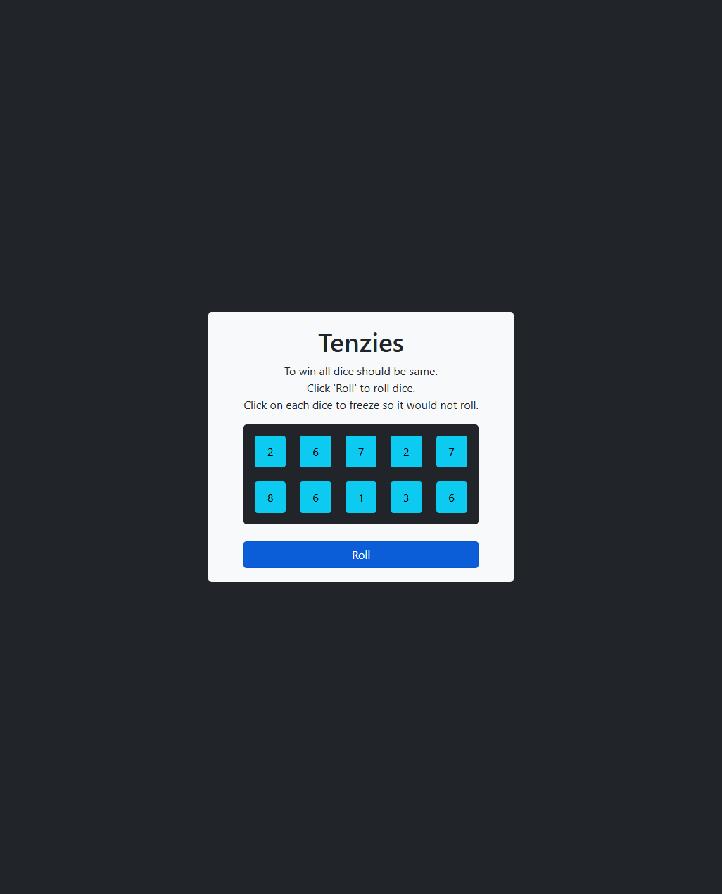
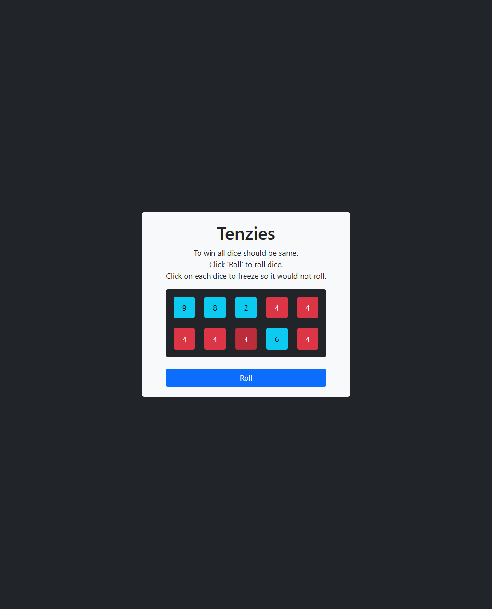
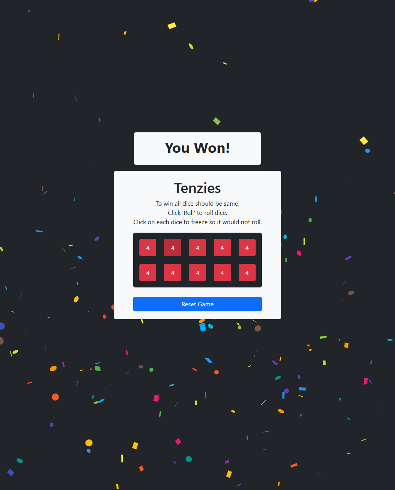

# Tenzies

A simple dice game built with React. Roll ten dice, freeze the ones you want to keep, and try to get all ten showing the same number in as few rolls as possible.

**Play it live:** https://tenzies-game-tqdv.onrender.com/

## Screenshots

| Start | In progress | Win |
| --- | --- | --- |
|  |  |  |

## How to play

1. Click **Roll** to roll all ten dice.
2. Click a die to freeze (or unfreeze) it at its current value. Frozen dice are highlighted red and won't change on the next roll.
3. Keep rolling until every die is frozen on the same number.
4. When you win, a confetti animation and "You Won!" banner appear, and the button becomes **Reset Game**.

## Tech stack

- [React](https://react.dev/) (bootstrapped with Create React App)
- [react-confetti](https://www.npmjs.com/package/react-confetti) for the win animation
- [react-use](https://www.npmjs.com/package/react-use) for the `useWindowSize` hook
- Bootstrap classes for styling

## Project structure

```
src/
  components/
    Button.js      # Roll / Reset Game button
    Dice.js         # A single die
    WinBanner.js    # "You Won!" banner shown on completion
  App.js            # Game state and logic
  index.js          # Entry point
```

## Getting started

### Prerequisites

- [Node.js](https://nodejs.org/) and npm installed

### Installation

```bash
git clone https://github.com/SupunSameera18/tenzies-game.git
cd tenzies-game
npm install
```

### Available scripts

- `npm start` runs the app in development mode at [http://localhost:3000](http://localhost:3000)
- `npm test` runs tests in watch mode
- `npm run build` builds the app for production into the `build` folder

## License

This project is for learning purposes and is not licensed for commercial use.
